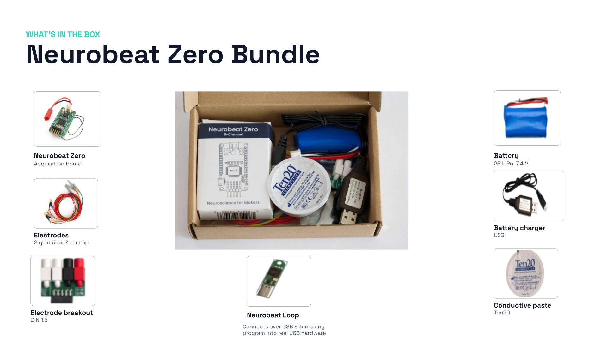

# Getting Started

Get up and running with **Zero** in a few minutes.

## What's Neurobeat Zero

Neurobeat Zero is a research-grade biopotential board small enough to go anywhere: Arduino-programmable, and streaming straight into the tools you already use, like BrainFlow and EEGLAB. No PC required. No USB to contaminate the signal. Deploy any app from the App Store in one click, encrypted end to end.

Two USB items ship in this box, and neither connects to the Neurobeat Zero: the charger cable charges the battery, and the Neurobeat Loop's cable connects the Neurobeat Loop to your computer.

## Assemble

### 1 · Charge the battery

Plug the battery into the USB charger and connect it to any USB power source. Leave it until the charger's indicator shows a full charge. Carry on assembling while it charges.

### 2 · Fit the electrodes

1. **Electrode breakout** → the angled header on the edge of the board. It only fits one way round, and it seats fully — press until it stops.
2. **Ear clips** → the sockets marked for bias and reference. These are your ground and your comparison point; without them you have no signal at all.
3. **Gold cups** → the remaining channel sockets. These are your recording sites.

### 3 · Connect the battery

**Battery** → the battery-adapter cable → the white JST plug on the Neurobeat Zero, and it will start as soon as the battery is connected. *Note: There's no power switch. Your device will enter standby mode automatically after 5 minutes of inactivity. Press the "Reset" button to wake it up.*

Your board is assembled!

[See how to get started, join your network, install apps, and take your first recording →](getting-started.md)
